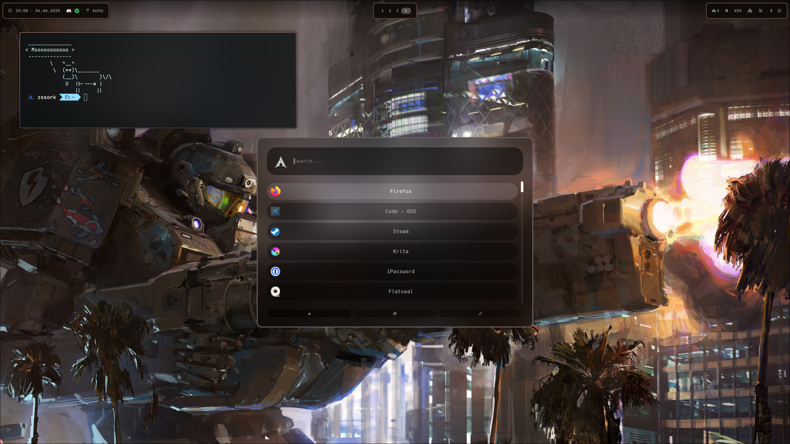

# SSSystem

> [!CAUTION]
> 
> This is an experimental setup!

  
&nbsp; 
  

## Components

- Packages
    - Check the `*.lst` files
- Terminal
    - kitty
    - zsh
    - zsh-autosuggestions
    - ohmyposh
- Waybar
- Audio
    - pipewire
    - GUI: pwvucontrol
- Desktop
    - hyprpaper
    - pywal16
- Lockscreen
    - Hyprlock
    - Hypridle (handles inactivity)
    - SDDM: sddm-astronaut-theme
- Clipboard manager
    - Rofi (SUPER+V)
    - cliphist
- Application Launcher
    - Rofi (SUPER+R)
- NotificationCenter
    - swaync
- Snapshots
    - btfs (filesystem)
    - Timeshift (for creating snapshots)

## Installation

You find my dotfiles [here](./theme) (i use them with [stow](https://www.gnu.org/software/stow/)). The `setup.sh` script can install this setup on a fresh hyprland system (with pipewire and btfs). The `app-install.sh` script installs some of the programs i use. If you want to use parts of this setup make shure you know what you are doing!

  
sssick dotsss

- https://github.com/elifouts/Dotfiles
- https://github.com/zDyanTB/HyprNova
- https://github.com/ensomnatt/dotfiles

  
wallpaper

- [John Wallin Liberto](https://www.artstation.com/captflushgarden)
- [Ruan Jia](https://www.artstation.com/ruanjia)

